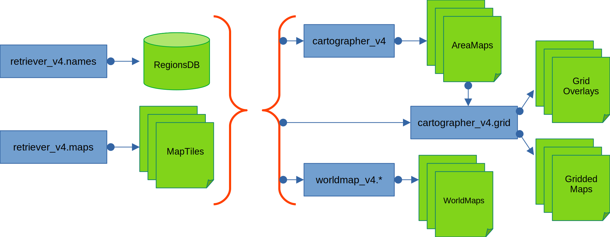

# Second Life Cartography

A set of **Python 3.11** scripts to generate:
  * High-resolution maps of a certain area
  * Mosaic map of the (SL) world
  * 'Nightlights map' of the world

_'Nightlights map' is what you get if you snap a long-exposure aerial picture of an area
on Earth, with lights of houses, buildings, street lamps, vehicles on the road, sea vessels, etc.
highlighting the lay of the land. In my implementation, I modified the presentation a bit to
better emphasize connected regions, allowing you to easily see big connected landmasses._

> **Note:** **Python 3.11 is a requirement.**
> 
> This package _might_ run on older Python versions, but
> I developed and tested these scripts using Python 3.11, so I might have inadvertently
> used features only available on Python 3.11, rendering them unable to run on older Python
> versions. Sorry, I just don't have the time nor desire to make this package
> backwards-compatible, and I _will_ reject Pull Requests whose sole purpose is to make
> this package backwards-compatible.
> 
> You are, of course, free to fork this package and build upon it. Just remember to honor the
> Licenses used in the package.


## Installation

After doing a `git clone` of the repo, install packages listed in `pyproject.toml`

```shell
cd sl-cartography
python -m pip install . 
```

(Of course you should do that inside a virtualenv)


## Architecture



## Contents

These are the **executable modules** provided by this library

To execute, after performing cloning and installation, do:

```shell
cd sl-cartography/src
python -u -m $MODULE_NAME parameters
```

To see what `parameters` are available, use `--help`

***All modules not listed here are either old modules kept for posterity, or libraries not meant to be invoked directly.***


### `retriever_v4.names` Module

Retrieves names from Second Life Cap Server to be stored in a database ("RegionsDB" in the architecture).

The retrieval is done in a brute-force way; no attempts are being made to validate if the returned names are valid (e.g., correspond to existing/accessible regions)


### `retriever_v4.names.xchg` Module

(Not shown in the architecture)

Exports RegionsDB to a YAML 1.2 file, and imports a YAML 1.2 file into a RegionsDB.


### `retriever_v4.maps` Module

Retrieves "map tiles" from Second Life Map Server. A "map tile" is a 256x256 JPEG image representing a region.

The retrieval is done in a brute-force way; no attempts are being made to validate if the returned map tiles are valid (e.g., correspond to existing/accessible regions)


### `cartographer_v4` Module

Grabs data from RegionsDB and collected Map Tiles, cross-referencing with a list of Known Areas, to make individual high-res area maps (1 map per defined area)


### `cartographer_v4.grid` Module

Grabs data from RegionsDB and collected Map Tiles, cross-referencing with a list of Known Areas, and make "Grid Overlays" that you can layer over the high-res area map to make "Gridded Maps"

(The module actually also creates the Gridded Map.)


### `worldmap_v4.mosaic` Module

Creates a Mosaic World Map, in which each regions are represented by a mosaic of subtiles.

Currently creates Mosaics of 1x1, 2x2, 3x3, 4x4, and 5x5 sizes.

**This module takes a long time to finish due to all the heavy maths involved.**


### `worldmap_v4.nightlights` Module

Creates a "Nightlights" World Map (see explanation at the beginning of this README)


### `sl-maptools` Module

A library of functions and classes used by the rest of the SL-Cartography package.

**Not executable.**


## Nomenclature

> **`WORK IN PROGRESS`**


## Contributing

Create an issue and/or a Pull Requests.

As previously mentioned: Pull Requests whose purpose are _solely_ for
backward-compatibility with Python<3.11 _will be outright rejected_.

Also, please follow these guidelines:

* Code MUST be formatted using **Black** with the configuration as stated in `pyproject.toml`
* In addition, imports MUST be formatted using **isort** with the configuration as set in `pyproject.toml`

**I will NOT accept PRs that has not formatted with Black and isort!**


## Licenses

Mostly MPL-2.0, with some exceptions. Please see the `LICENSE` file for details.

Most notably, the usage of data & API of [GridSurvey](http://www.gridsurvey.com)
is licensed under [CC-BY-2.0-UK](https://creativecommons.org/licenses/by/2.0/uk/).
